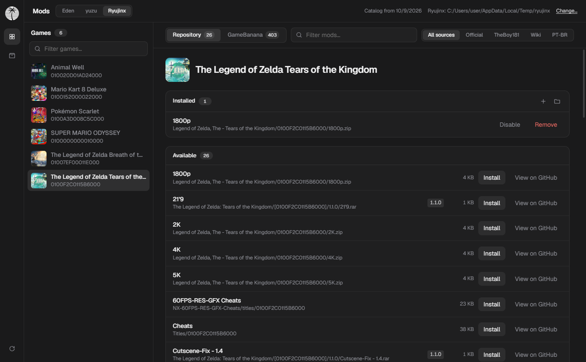
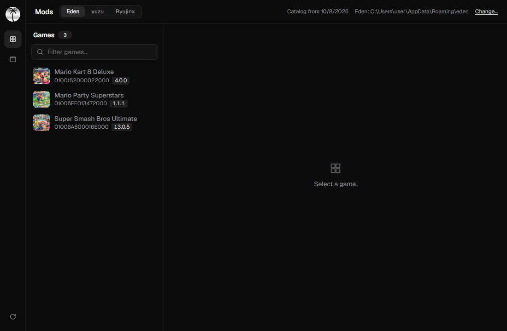
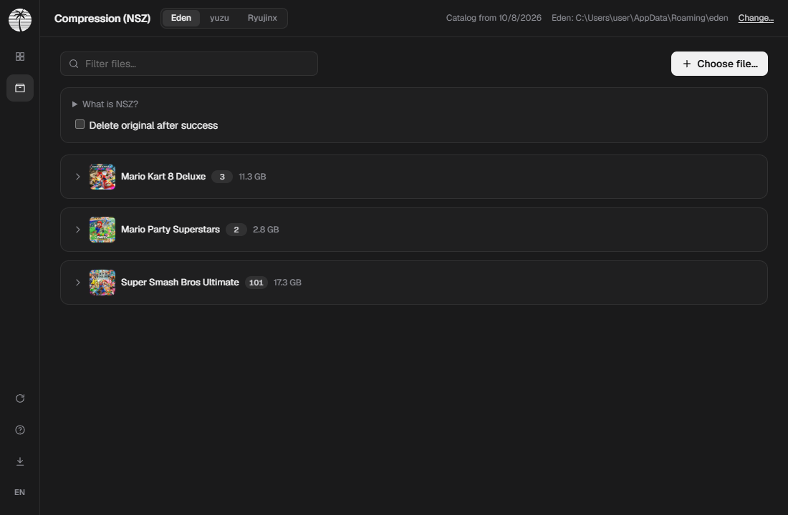
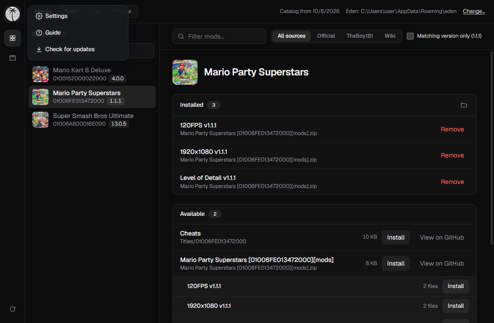
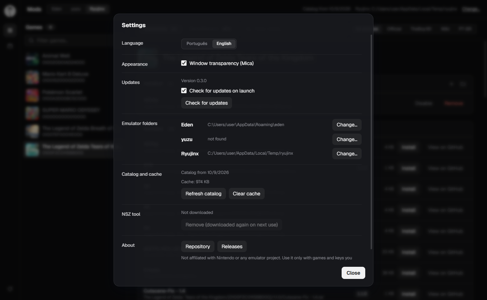
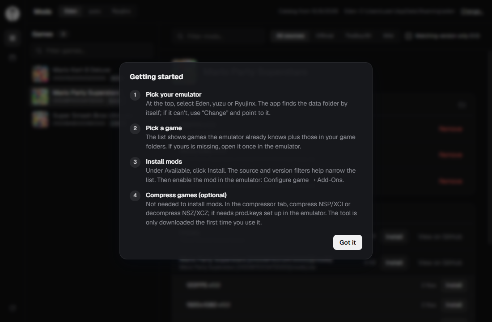

<div align="center">


# Eden Mod Manager

**Browse, install and manage Nintendo Switch mods for Eden, yuzu and Ryujinx.**<br />
Optional built-in NSZ compressor. Windows, Linux and macOS.

[](https://github.com/pendiego/Eden-Mod-Manager/actions/workflows/build.yml)
[](https://github.com/pendiego/Eden-Mod-Manager/releases/latest)
[](LICENSE)

</div>

---

## Screenshots

<p align="center">
  
</p>

<table>
  <tr>
    <td></td>
    <td></td>
  </tr>
  <tr>
    <td align="center">Your games</td>
    <td align="center">NSZ compressor</td>
  </tr>
</table>

<table>
  <tr>
    <td></td>
    <td></td>
  </tr>
  <tr>
    <td align="center">App menu</td>
    <td align="center">Settings</td>
  </tr>
</table>

<p align="center">
  
</p>

## Features

- **Finds your emulator automatically.** Detects the data folder (including Flatpak and portable `user` setups) and your game folders.
- **Your games, with cover art.** Reads the emulator's own game list and covers, and fetches missing ones.
- **Three mod catalogs in one list.** Official database, TheBoy181 and the Switch Mods Wiki Archive, merged and de-duplicated.
- **Filters that cut the noise.** Search by name, filter by source, or show only mods matching your installed game version.
- **Safe installs.** Pick which variants of a package to install (resolutions, FPS, etc.), and remove them again with one click.
- **Optional NSZ compressor.** Compress NSP/XCI and decompress NSZ/XCZ, with progress and verification. The tool is downloaded only on first use.
- **Bilingual UI.** English and Portuguese.
- **Auto-update.** Checks for new versions on launch (can be turned off in Settings) and updates in one click (the portable build replaces itself, with signature verification).
- **Settings.** Language, per-emulator data folders, cache and NSZ tool management, update preferences.

## Download

Grab the latest build from the [Releases page](https://github.com/pendiego/Eden-Mod-Manager/releases/latest).

| Platform | File | Notes |
|---|---|---|
| Windows | `*-setup.exe` | Installer |
| Windows | `EdenModManager-portable.zip` | No install; keeps all data next to the `.exe` |
| Linux | `.deb`, `.AppImage` | Needs WebKitGTK 4.1 |
| macOS | `.dmg` | Apple Silicon. Not notarized: allow it in System Settings on first launch |

## Getting started

1. Pick your emulator at the top (Eden, yuzu or Ryujinx). If its folder is not found, use **Change**.
2. Select a game from the list.
3. Click **Install** on a mod, then enable it in the emulator: *Configure game → Add-Ons*.

A short in-app guide opens on first launch. Click the app icon at the top left for the menu (Settings, Guide, Check for updates).

### Default data folders

| Emulator | Windows | Linux | macOS |
|---|---|---|---|
| Eden, yuzu | `%APPDATA%\<name>` | `~/.local/share/<name>` | `~/Library/Application Support/<name>` |
| Ryujinx | `%APPDATA%\Ryujinx` | `~/.config/Ryujinx` | `~/Library/Application Support/Ryujinx` |

### Portable mode (Windows)

Keep a file named `portable` next to `EdenModManager.exe` and the app stores its settings, cache and tools in a `data/` folder beside it. Remove the file to go back to the regular user profile.

## NSZ compressor

Optional, and not needed for mods. It requires `prod.keys` configured in your emulator. The [nsz](https://github.com/nicoboss/nsz) CLI is downloaded the first time you use it. On macOS it works on Apple Silicon only (upstream ships no Intel binary).

## Building from source

Requirements: [Node.js](https://nodejs.org) 22+, [Rust](https://rustup.rs) stable and the [Tauri prerequisites](https://tauri.app/start/prerequisites/). On Debian/Ubuntu:

```sh
sudo apt install libwebkit2gtk-4.1-dev libgtk-3-dev librsvg2-dev patchelf
```

```sh
npm ci
npm run tauri dev     # run with hot reload
npm run tauri build   # produce installers
```

Checks:

```sh
npm run check
cargo test --manifest-path src-tauri/Cargo.toml
```

Built with [Tauri 2](https://tauri.app), [SvelteKit](https://svelte.dev) and Rust.

## Credits

Mod data comes from [Switch-Emulator-Mod-Database](https://github.com/ADEMOLA200/Switch-Emulator-Mod-Database), [theboy181/switch-ptchtxt-mods](https://github.com/theboy181/switch-ptchtxt-mods) and [Switch-Mods-Wiki-Archive](https://github.com/amakvana/Switch-Mods-Wiki-Archive). Compression by [nsz](https://github.com/nicoboss/nsz). Cover art from [nlib](https://api.nlib.cc).

Eden Mod Manager is not affiliated with Nintendo or any emulator project. Use it only with games and keys you legally own.

## License

[MIT](LICENSE)
