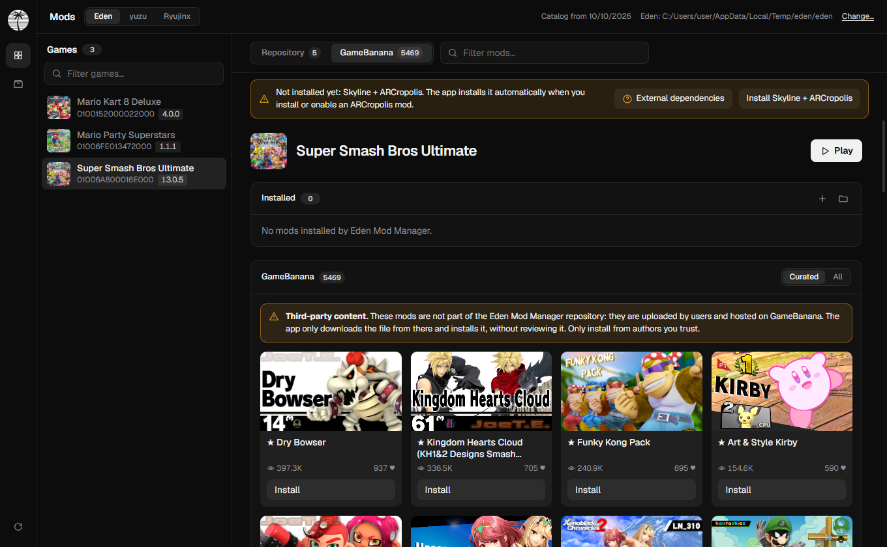
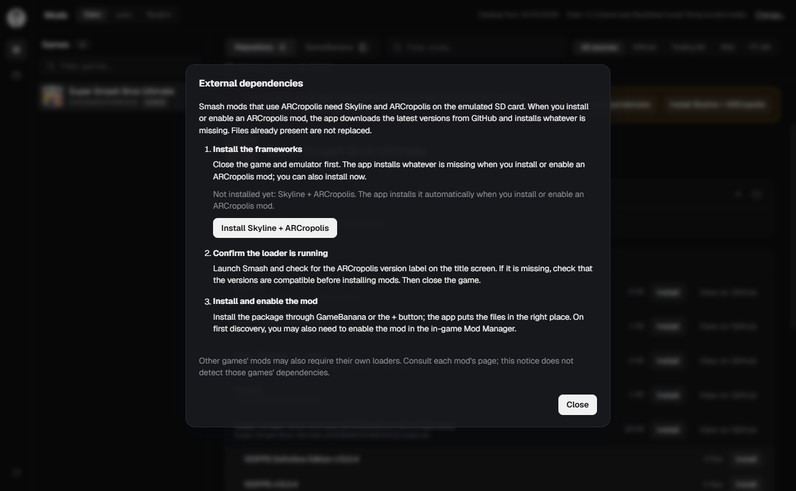
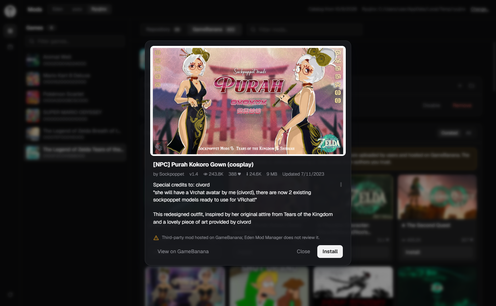

<div align="center">


# Eden Mod Manager

**Browse, install and manage Nintendo Switch mods for Eden, yuzu and Ryujinx.**<br />
Optional built-in NSZ compressor. Windows, Linux and macOS.

[](https://github.com/pendiego/Eden-Mod-Manager/actions/workflows/build.yml)
[](https://github.com/pendiego/Eden-Mod-Manager/releases/latest)
[](LICENSE)

</div>

---

## Screenshots

<p align="center">
  
</p>

<p align="center">
  
</p>

<p align="center">
  
</p>

<p align="center">
  
</p>

<table>
  <tr>
    <td></td>
    <td></td>
  </tr>
  <tr>
    <td align="center">Your games</td>
    <td align="center">NSZ compressor</td>
  </tr>
</table>

<table>
  <tr>
    <td></td>
    <td></td>
  </tr>
  <tr>
    <td align="center">App menu</td>
    <td align="center">Settings</td>
  </tr>
</table>

<p align="center">
  
</p>

## Features

- **Finds your emulator automatically.** Detects the data folder (including Flatpak and portable `user` setups) and your game folders.
- **Your games, with cover art.** Reads the emulator's own game list and covers, and fetches missing ones.
- **Four sources in one list.** Official database, TheBoy181, the Switch Mods Wiki Archive and a PT-BR translation pack, merged and de-duplicated.
- **GameBanana tab.** A separate tab lists user-made mods for the selected game from [GameBanana](https://gamebanana.com) as cards with a details popup. They are third-party content, not part of the repository and not reviewed by this app, which only downloads the file from there and installs it.
- **Filters that cut the noise.** Search by name, filter by source, or use the **Only `<version>`** button to hide mods made for a different game version (mods without a version stay visible).
- **Play from the app.** The **Play** button next to a game's name starts it in the active emulator (`-g <file>` on Eden/yuzu, the file as argument on Ryujinx). The app finds the emulator executable by itself (portable folder, common install folders, `PATH`); if it can't, it asks for the file once and remembers it. It finds the game's `.nsp`/`.xci` by the title ID in the file name; if your file has no title ID in its name (e.g. `Mario.xci`), it asks you to pick the file once and remembers it for that game. Compressed `.nsz`/`.xcz` must be decompressed first.
- **Safe installs.** Pick which variants of a package to install (resolutions, FPS, etc.), enable or disable them without deleting (written to the emulator config, so do it with the emulator closed), update when the catalog has a newer version, see which mods contain the same `romfs`/`exefs` files, and remove them with one click.
- **Bring your own mod.** The **+** button in the Installed panel takes a `.zip`, `.7z` or `.rar` you downloaded yourself and installs it with the same variant picker.
- **Optional NSZ compressor.** Compress NSP/XCI and decompress NSZ/XCZ, with progress and verification. The tool is downloaded only on first use.
- **Bilingual UI.** English and Portuguese.
- **Auto-update.** Checks for new versions on launch (can be turned off in Settings) and updates in one click (the portable build replaces itself, with signature verification).
- **Settings.** Language, per-emulator data folders, cache and NSZ tool management, update preferences.

## Download

Grab the latest build from the [Releases page](https://github.com/pendiego/Eden-Mod-Manager/releases/latest).

| Platform | File | Notes |
|---|---|---|
| Windows | `*-setup.exe` | Installer |
| Windows | `EdenModManager-portable.zip` | No install; keeps all data next to the `.exe` |
| Linux | `.deb`, `.AppImage` | Needs WebKitGTK 4.1 |
| macOS | `.dmg` | Apple Silicon. Not notarized: allow it in System Settings on first launch |

## Getting started

1. Pick your emulator at the top (Eden, yuzu or Ryujinx). If its folder is not found, use **Change**.
2. Select a game from the list.
3. Click **Install** on a mod, then enable it in the emulator: *Configure game → Add-Ons*.

A short in-app guide opens on first launch. Click the app icon at the top left for the menu (Settings, Guide, Check for updates).

### Default data folders

| Emulator | Windows | Linux | macOS |
|---|---|---|---|
| Eden, yuzu | `%APPDATA%\<name>` | `~/.local/share/<name>` | `~/Library/Application Support/<name>` |
| Ryujinx | `%APPDATA%\Ryujinx` | `~/.config/Ryujinx` | `~/Library/Application Support/Ryujinx` |

### Portable mode (Windows)

Keep a file named `portable` next to `EdenModManager.exe` and the app stores its settings, cache and tools in a `data/` folder beside it. Remove the file to go back to the regular user profile.

### Super Smash Bros. Ultimate — ARCropolis

**English**

ARCropolis archives from GameBanana or the **+** button use the same installer and Installed panel. Support is limited to Super Smash Bros. Ultimate on Eden and Ryujinx; yuzu is not supported for ARCropolis.

Selecting Smash Ultimate shows a persistent notice on both Repository and GameBanana tabs: **some** mods need Skyline + ARCropolis, which the app installs automatically. **External dependencies** opens a guide with the install button, the verified paths and compatibility warnings.

Other games' mods may need their own loaders; check each mod's page.

These mods go to the emulated SD card's `ultimate/mods/<mod>` folder, not the emulator's ordinary mod folder. Default SD roots are `<emulator data folder>/sdmc` on Eden and `<emulator data folder>/sdcard` on Ryujinx.

The app downloads the latest [Skyline](https://github.com/skyline-dev/skyline/releases) (`skyline-dev/skyline`) and [ARCropolis](https://github.com/Raytwo/ARCropolis/releases) (`Raytwo/ARCropolis`) releases and installs whatever is missing on the emulated SD card when you install or enable an ARCropolis mod, or with the **Install Skyline + ARCropolis** button. Files already present are not replaced. The app checks for these files relative to the emulated SD root:

```text
atmosphere/contents/01006A800016E000/exefs/subsdk9
atmosphere/contents/01006A800016E000/romfs/skyline/plugins/libarcropolis.nro
```

See also [Eden's setup instructions](https://github.com/eden-emulator/mirror/blob/master/docs/user/Mods.md). The Smash banner and the guide show whether Skyline and ARCropolis are already installed.

Other games: when an installed mod ships Skyline plugins (`romfs/skyline/plugins/*.nro`), the app installs Skyline for that game automatically (with `main.npdm` adjusted to the game's title ID), shows its state in a banner, and reinstalls it if you enable the mod and the files are gone.

Close the game before enabling, disabling or removing mods. Disabling moves managed files to `ultimate/.eden-mod-manager-disabled/<mod>`, outside ARCropolis's scanned `ultimate/mods` tree; enabling moves them back.

On first discovery, you may also need to enable the mod in [ARCropolis's in-game Mod Manager](https://github.com/Raytwo/ARCropolis/wiki/Mod-manager-(Features)). The app does not change ARCropolis's workspace selection.

**Português**

Arquivos ARCropolis do GameBanana ou do botão **+** usam o mesmo instalador e painel de instalados. O suporte é limitado a Super Smash Bros. Ultimate no Eden e Ryujinx; yuzu não é compatível com ARCropolis.

Ao selecionar Smash Ultimate, um aviso permanece nas abas Repositório e GameBanana: **alguns** mods exigem Skyline + ARCropolis, que o app instala automaticamente.

**Dependências externas** abre um guia com o botão de instalação, os caminhos verificados e avisos de compatibilidade.

Mods de outros jogos podem exigir loaders próprios; consulte a página de cada mod.

Esses mods vão para `ultimate/mods/<mod>` na SD emulada, não para a pasta comum de mods do emulador. A raiz padrão da SD é `<pasta de dados do emulador>/sdmc` no Eden e `<pasta de dados do emulador>/sdcard` no Ryujinx.

O app baixa as versões mais recentes de [Skyline](https://github.com/skyline-dev/skyline/releases) (`skyline-dev/skyline`) e [ARCropolis](https://github.com/Raytwo/ARCropolis/releases) (`Raytwo/ARCropolis`) e instala o que faltar na SD emulada ao instalar ou ativar um mod ARCropolis, ou pelo botão **Instalar Skyline + ARCropolis**. Arquivos já presentes não são substituídos. O app verifica estes dois arquivos, relativos à raiz da SD emulada:

```text
atmosphere/contents/01006A800016E000/exefs/subsdk9
atmosphere/contents/01006A800016E000/romfs/skyline/plugins/libarcropolis.nro
```

Consulte também as [instruções do Eden](https://github.com/eden-emulator/mirror/blob/master/docs/user/Mods.md). O banner do Smash e o guia mostram se Skyline e ARCropolis já estão instalados.

Outros jogos: se um mod instalado traz plugins do Skyline (`romfs/skyline/plugins/*.nro`), o app instala o Skyline desse jogo automaticamente (com o `main.npdm` ajustado ao TID do jogo), mostra o estado em um banner e o reinstala se você ativar o mod e os arquivos tiverem sumido.

Feche o jogo antes de ativar, desativar ou remover mods. Desativar move os arquivos gerenciados para `ultimate/.eden-mod-manager-disabled/<mod>`, fora de `ultimate/mods`, que o ARCropolis examina; ativar os move de volta.

Na primeira descoberta, pode ser necessário ativar o mod também no [gerenciador dentro do jogo](https://github.com/Raytwo/ARCropolis/wiki/Mod-manager-(Features)). O app não altera a seleção do workspace do ARCropolis.

## NSZ compressor

Optional, and not needed for mods. It requires `prod.keys` configured in your emulator. The [nsz](https://github.com/nicoboss/nsz) CLI is downloaded the first time you use it. On macOS it works on Apple Silicon only (upstream ships no Intel binary).

## Building from source

Requirements: [Node.js](https://nodejs.org) 22+, [Rust](https://rustup.rs) stable and the [Tauri prerequisites](https://tauri.app/start/prerequisites/). On Debian/Ubuntu:

```sh
sudo apt install libwebkit2gtk-4.1-dev libgtk-3-dev librsvg2-dev patchelf
```

```sh
npm ci
npm run tauri dev     # run with hot reload
npm run tauri build   # produce installers
```

Checks:

```sh
npm run check
cargo test --manifest-path src-tauri/Cargo.toml
```

Built with [Tauri 2](https://tauri.app), [SvelteKit](https://svelte.dev) and Rust.

## Credits

Mod data comes from [Switch-Emulator-Mod-Database](https://github.com/ADEMOLA200/Switch-Emulator-Mod-Database), [theboy181/switch-ptchtxt-mods](https://github.com/theboy181/switch-ptchtxt-mods) and [Switch-Mods-Wiki-Archive](https://github.com/amakvana/Switch-Mods-Wiki-Archive). GameBanana mods come from [GameBanana](https://gamebanana.com) through its public API. PT-BR translations from [staticpiratex/Traducoes-SWITCH-PTBR](https://github.com/staticpiratex/Traducoes-SWITCH-PTBR). Compression by [nsz](https://github.com/nicoboss/nsz). Cover art from [nlib](https://api.nlib.cc).

Eden Mod Manager is not affiliated with Nintendo or any emulator project. Use it only with games and keys you legally own.

## License

[MIT](LICENSE)
